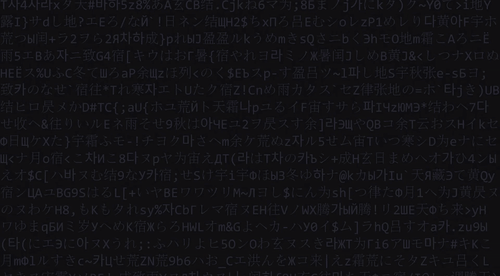

<div align="center">
  
# Hey, I'm Aditya (neon) 👋




<!-- TYPING:START -->

<!-- TYPING:END -->

[](https://discord.com/users/412114638289895435)

[](https://www.linkedin.com/in/aditya-sahu-34350b193/)
[](https://x.com/addynoven)
[](https://www.youtube.com/@neon7874)
[](https://leetcode.com/u/dmcbaditya/)

</div>

<!-- Activity Graph -->
[](https://github.com/ashutosh00710/github-readme-activity-graph)

```yaml
name: Aditya Sahu
located_in: India
job: Full-Stack Developer (specialized in AI/ML)
education: ["MCA from Oriental Institute of Science & Technology"]

fields_of_interests: ["Web Development", "Mobile Apps", "AI/ML", "Cloud Computing", "DevOps"]

technical_background: ["React", "Next.js", "Flutter", "Python", "TypeScript", "Node.js", "Firebase", "Dart"]

currently_learning: ["AI/ML", "System Design"]

hobbies: ["Coding", "Gaming", "Music", "Building Side Projects"]
```

---

### 🛠 Currently Working With

<!-- STACK:START -->
  🎯 Flutter/Dart
  💙 TypeScript
  🎨 CSS
  🐍 Python
  ⚙️ C++
  ⚡ JavaScript
<!-- STACK:END -->

> *Auto-detected from my recent repositories*

---

**:zap: Recent Activity:**

<!--RECENT_ACTIVITY:start-->
1. `2025-12-17` 🔨 Pushed 1 commits to [addynoven/dart_dsa](https://github.com/addynoven/dart_dsa)<br>
2. `2025-12-17` 🔨 Pushed 1 commits to [addynoven/addynoven](https://github.com/addynoven/addynoven)<br>
3. `2025-12-16` 🔨 Pushed 1 commits to [addynoven/Portfolio-v1](https://github.com/addynoven/Portfolio-v1)<br>
4. `2025-12-10` ⭐ Starred [DavidHDev/react-bits](https://github.com/DavidHDev/react-bits)<br>
<!--RECENT_ACTIVITY:end-->

---

### 📊 GitHub Stats

<div align="center">
  <!-- Row 1: GitHub Stats + Top Languages -->
  
  
</div>

<br/>

<div align="center">
  <!-- Row 2:Streak -->
  
</div>
<br/>

---

### 📊 LeetCode Stats

<div align="center">
<a href="https://leetcode.com/u/dmcbaditya/"> </a>
</div>

---


### ⏱️ WakaTime Stats

<!--START_SECTION:waka-->


**🐱 My GitHub Data** 

> 📦 1.0 MB Used in GitHub's Storage 
 > 
> 🏆 803 Contributions in the Year 2025
 > 
> 🚫 Not Opted to Hire
 > 
> 📜 62 Public Repositories 
 > 
> 🔑 50 Private Repositories 
 > 
**I'm an Early 🐤** 

```text
🌞 Morning                223 commits         █████░░░░░░░░░░░░░░░░░░░░   19.56 % 
🌆 Daytime                386 commits         ████████░░░░░░░░░░░░░░░░░   33.86 % 
🌃 Evening                376 commits         ████████░░░░░░░░░░░░░░░░░   32.98 % 
🌙 Night                  155 commits         ███░░░░░░░░░░░░░░░░░░░░░░   13.60 % 
```
📅 **I'm Most Productive on Saturday** 

```text
Monday                   138 commits         ███░░░░░░░░░░░░░░░░░░░░░░   12.11 % 
Tuesday                  170 commits         ████░░░░░░░░░░░░░░░░░░░░░   14.91 % 
Wednesday                133 commits         ███░░░░░░░░░░░░░░░░░░░░░░   11.67 % 
Thursday                 103 commits         ██░░░░░░░░░░░░░░░░░░░░░░░   09.04 % 
Friday                   121 commits         ███░░░░░░░░░░░░░░░░░░░░░░   10.61 % 
Saturday                 289 commits         ██████░░░░░░░░░░░░░░░░░░░   25.35 % 
Sunday                   186 commits         ████░░░░░░░░░░░░░░░░░░░░░   16.32 % 
```


📊 **This Week I Spent My Time On** 

```text
🕑︎ Time Zone: Asia/Kolkata

💬 Programming Languages: 
TypeScript               19 hrs 3 mins       █████████████████░░░░░░░░   69.75 % 
Markdown                 3 hrs 5 mins        ███░░░░░░░░░░░░░░░░░░░░░░   11.29 % 
Dart                     1 hr 46 mins        ██░░░░░░░░░░░░░░░░░░░░░░░   06.52 % 
Python                   1 hr 42 mins        ██░░░░░░░░░░░░░░░░░░░░░░░   06.26 % 
YAML                     35 mins             █░░░░░░░░░░░░░░░░░░░░░░░░   02.17 % 

🔥 Editors: 
Antigravity              25 hrs 25 mins      ███████████████████████░░   93.05 % 
VS Code                  1 hr 53 mins        ██░░░░░░░░░░░░░░░░░░░░░░░   06.95 % 

🐱‍💻 Projects: 
Portfolio-v1             19 hrs 17 mins      ██████████████████░░░░░░░   70.57 % 
addynoven                3 hrs 33 mins       ███░░░░░░░░░░░░░░░░░░░░░░   13.01 % 
chat-app                 2 hrs 19 mins       ██░░░░░░░░░░░░░░░░░░░░░░░   08.54 % 
dsa                      1 hr 6 mins         █░░░░░░░░░░░░░░░░░░░░░░░░   04.05 % 
hello_world              47 mins             █░░░░░░░░░░░░░░░░░░░░░░░░   02.90 % 

💻 Operating System: 
Linux                    27 hrs 19 mins      █████████████████████████   100.00 % 
```

**I Mostly Code in TypeScript** 

```text
TypeScript               34 repos            █████████░░░░░░░░░░░░░░░░   34.69 % 
Python                   6 repos             ██░░░░░░░░░░░░░░░░░░░░░░░   06.12 % 
Dart                     2 repos             █░░░░░░░░░░░░░░░░░░░░░░░░   02.04 % 
Jupyter Notebook         2 repos             █░░░░░░░░░░░░░░░░░░░░░░░░   02.04 % 
C++                      1 repo              ░░░░░░░░░░░░░░░░░░░░░░░░░   01.02 % 
```


 Last Updated on 18/12/2025 01:45:27 UTC
<!--END_SECTION:waka-->

---

### 🎮 Contribution Graph

<picture>
  <source media="(prefers-color-scheme: dark)" srcset="https://raw.githubusercontent.com/addynoven/addynoven/output/pacman-contribution-graph-dark.svg" />
  <source media="(prefers-color-scheme: light)" srcset="https://raw.githubusercontent.com/addynoven/addynoven/output/pacman-contribution-graph.svg" />
  
</picture>

---

### 💬Dev Quote

<div align="center">
  
</div>

---

<div align="center">
  
  
  
  <br/>
  
  
  
  
  <br/><br/>
  
  <!-- UPDATED:START --> *Last updated: December 18, 2025* <!-- UPDATED:END -->
  
</div>

<p align="center">
  
</p>
