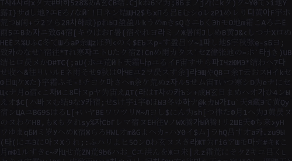

<div align="center">
  
# Hey, I'm Aditya (neon) 👋




<!-- TYPING:START -->

<!-- TYPING:END -->

[](https://discord.com/users/412114638289895435)

[](https://www.linkedin.com/in/aditya-sahu-34350b193/)
[](https://x.com/addynoven)
[](https://www.youtube.com/@neon7874)
[](https://leetcode.com/u/dmcbaditya/)

</div>

<!-- Activity Graph -->
[](https://github.com/ashutosh00710/github-readme-activity-graph)

```yaml
name: Aditya Sahu
located_in: India
job: Full-Stack Developer (specialized in AI/ML)
education: ["MCA from Oriental Institute of Science & Technology"]

fields_of_interests: ["Web Development", "Mobile Apps", "AI/ML", "Cloud Computing", "DevOps"]

technical_background: ["React", "Next.js", "Flutter", "Python", "TypeScript", "Node.js", "Firebase", "Dart"]

currently_learning: ["AI/ML", "System Design"]

hobbies: ["Coding", "Gaming", "Music", "Building Side Projects"]
```

---

### 🛠 Currently Working With

<!-- STACK:START -->
  🟣 Kotlin
  💙 TypeScript
  🌐 HTML/CSS
  🎨 CSS
  ⚡ JavaScript
  🐚 Shell
<!-- STACK:END -->

> *Auto-detected from my recent repositories*

---

**:zap: Recent Activity:**

<!--RECENT_ACTIVITY:start-->
1. `2026-08-17` 🔨 Pushed 1 commits to [addynoven/addynoven](https://github.com/addynoven/addynoven)<br>
2. `2026-08-16` ⭐ Starred [nkrider7/fishman](https://github.com/nkrider7/fishman)<br>
3. `2026-08-15` ⭐ Starred [Ashutoshx7/VengeanceUI](https://github.com/Ashutoshx7/VengeanceUI)<br>
4. `2026-08-14` ⭐ Starred [ShivaBhattacharjee/Tokokino](https://github.com/ShivaBhattacharjee/Tokokino)<br>
5. `2026-08-09` 🔨 Pushed 1 commits to [addynoven/mihon](https://github.com/addynoven/mihon)<br>
6. `2026-08-08` 🔨 Pushed 1 commits to [addynoven/music_server](https://github.com/addynoven/music_server)<br>
7. `2026-08-08` 🔨 Pushed 1 commits to [addynoven/portscope](https://github.com/addynoven/portscope)<br>
8. `2026-08-08` 🔨 Pushed 1 commits to [addynoven/portifolo](https://github.com/addynoven/portifolo)<br>
9. `2026-08-08` 🔨 Pushed 1 commits to [addynoven/music-package](https://github.com/addynoven/music-package)<br>
10. `2026-08-08` 🔨 Pushed 1 commits to [addynoven/bemuse](https://github.com/addynoven/bemuse)<br>
<!--RECENT_ACTIVITY:end-->

---

### 📊 GitHub Stats

<div align="center">
  <!-- Row 1: GitHub Stats + Top Languages -->
  
  
</div>

<br/>

<div align="center">
  <!-- Row 2:Streak -->
  
</div>
<br/>

---

### 📊 LeetCode Stats

<div align="center">
<a href="https://leetcode.com/u/dmcbaditya/"> </a>
</div>

---


### ⏱️ WakaTime Stats

<!--START_SECTION:waka-->


**🐱 My GitHub Data** 

> 📦 4.4 MB Used in GitHub's Storage 
 > 
> 🏆 1,950 Contributions in the Year 2026
 > 
> 🚫 Not Opted to Hire
 > 
> 📜 109 Public Repositories 
 > 
> 🔑 129 Private Repositories 
 > 
**I'm a Night 🦉** 

```text
🌞 Morning                1400 commits        █████░░░░░░░░░░░░░░░░░░░░   19.54 % 
🌆 Daytime                2086 commits        ███████░░░░░░░░░░░░░░░░░░   29.11 % 
🌃 Evening                2406 commits        ████████░░░░░░░░░░░░░░░░░   33.58 % 
🌙 Night                  1274 commits        ████░░░░░░░░░░░░░░░░░░░░░   17.78 % 
```
📅 **I'm Most Productive on Sunday** 

```text
Monday                   814 commits         ███░░░░░░░░░░░░░░░░░░░░░░   11.36 % 
Tuesday                  1095 commits        ████░░░░░░░░░░░░░░░░░░░░░   15.28 % 
Wednesday                611 commits         ██░░░░░░░░░░░░░░░░░░░░░░░   08.53 % 
Thursday                 902 commits         ███░░░░░░░░░░░░░░░░░░░░░░   12.59 % 
Friday                   1197 commits        ████░░░░░░░░░░░░░░░░░░░░░   16.70 % 
Saturday                 1200 commits        ████░░░░░░░░░░░░░░░░░░░░░   16.75 % 
Sunday                   1347 commits        █████░░░░░░░░░░░░░░░░░░░░   18.80 % 
```


📊 **This Week I Spent My Time On** 

```text
🕑︎ Time Zone: Asia/Kolkata

💬 Programming Languages: 
No Activity Tracked This Week

🔥 Editors: 
No Activity Tracked This Week

🐱‍💻 Projects: 
No Activity Tracked This Week

💻 Operating System: 
No Activity Tracked This Week
```

🤖 **AI Coding This Week** 

```text
No AI Coding Activity Tracked This Week
```

**I Mostly Code in TypeScript** 

```text
TypeScript               86 repos            ███████████░░░░░░░░░░░░░░   42.57 % 
JavaScript               40 repos            █████░░░░░░░░░░░░░░░░░░░░   19.80 % 
Python                   18 repos            ██░░░░░░░░░░░░░░░░░░░░░░░   08.91 % 
Kotlin                   7 repos             █░░░░░░░░░░░░░░░░░░░░░░░░   03.47 % 
Solidity                 1 repo              ░░░░░░░░░░░░░░░░░░░░░░░░░   00.50 % 
```


 Last Updated on 17/08/2026 01:23:24 UTC
<!--END_SECTION:waka-->

---

### 🎮 Contribution Graph

<picture>
  <source media="(prefers-color-scheme: dark)" srcset="https://raw.githubusercontent.com/addynoven/addynoven/output/pacman-contribution-graph-dark.svg" />
  <source media="(prefers-color-scheme: light)" srcset="https://raw.githubusercontent.com/addynoven/addynoven/output/pacman-contribution-graph.svg" />
  
</picture>

---

### 💬Dev Quote

<div align="center">
  
</div>

---

<div align="center">
  
  
  
  <br/>
  
  
  
  
  <br/><br/>
  
  <!-- UPDATED:START --> *Last updated: August 17, 2026* <!-- UPDATED:END -->
  
</div>

<p align="center">
  
</p>
