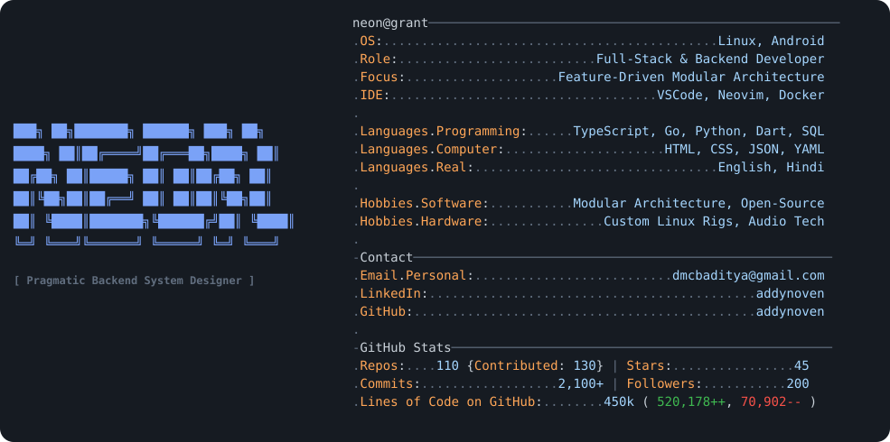
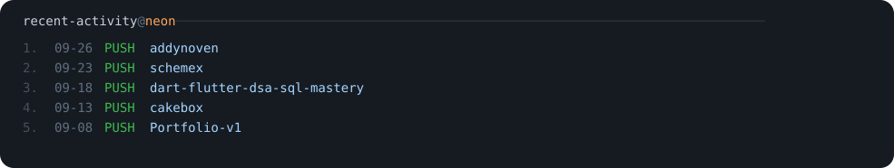

<table width="100%" border="0" cellspacing="0" cellpadding="0">
<tr>
<td width="48%" align="center" valign="middle">

</td>
<td width="52%" align="center" valign="middle" style="padding-left: 20px;">

<h1 style="margin: 0 0 8px 0; font-size: 32px; border-bottom: none;">Aditya Sahu</h1>

<!-- TYPING:START -->

<!-- TYPING:END -->

<p style="margin: 18px 0 0 0;">
<a href="https://portfolio-v1-tau-lake.vercel.app/"></a> &nbsp;&nbsp;&nbsp;
<a href="https://github.com/addynoven"></a> &nbsp;&nbsp;&nbsp;
<a href="https://www.linkedin.com/in/aditya-sahu-34350b193/"></a> &nbsp;&nbsp;&nbsp;
<a href="https://x.com/addynoven"></a> &nbsp;&nbsp;&nbsp;
<a href="https://www.youtube.com/@neon7874"></a>
</p>

</td>
</tr>
</table>



---



### 📊 Activity & Language Telemetry

**🐱 Commit Time Distribution**

```text
🌞 Morning                1484 commits        █████░░░░░░░░░░░░░░░░░░░░   20.45 % 
🌆 Daytime                2088 commits        ███████░░░░░░░░░░░░░░░░░░   28.78 % 
🌃 Evening                2415 commits        ████████░░░░░░░░░░░░░░░░░   33.29 % 
🌙 Night                  1268 commits        ████░░░░░░░░░░░░░░░░░░░░░   17.48 % 
```

📅 **Productivity by Day**

```text
Monday                   859 commits         ███░░░░░░░░░░░░░░░░░░░░░░   11.84 % 
Tuesday                  1145 commits        ████░░░░░░░░░░░░░░░░░░░░░   15.78 % 
Wednesday                617 commits         ██░░░░░░░░░░░░░░░░░░░░░░░   08.50 % 
Thursday                 883 commits         ███░░░░░░░░░░░░░░░░░░░░░░   12.17 % 
Friday                   1200 commits        ████░░░░░░░░░░░░░░░░░░░░░   16.54 % 
Saturday                 1201 commits        ████░░░░░░░░░░░░░░░░░░░░░   16.55 % 
Sunday                   1350 commits        █████░░░░░░░░░░░░░░░░░░░░   18.61 % 
```

**💻 Language Distribution**

```text
TypeScript               87 repos            ███████████░░░░░░░░░░░░░░   42.86 % 
JavaScript               40 repos            █████░░░░░░░░░░░░░░░░░░░░   19.70 % 
Python                   18 repos            ██░░░░░░░░░░░░░░░░░░░░░░░   08.87 % 
Kotlin                   7 repos             █░░░░░░░░░░░░░░░░░░░░░░░░   03.45 % 
Solidity                 1 repo              ░░░░░░░░░░░░░░░░░░░░░░░░░   00.49 % 
```

---

### 🎮 Contribution Canvas

<div align="center">
  <picture>
    <source media="(prefers-color-scheme: dark)" srcset="https://raw.githubusercontent.com/addynoven/addynoven/output/pacman-contribution-graph-dark.svg" />
    <source media="(prefers-color-scheme: light)" srcset="https://raw.githubusercontent.com/addynoven/addynoven/output/pacman-contribution-graph.svg" />
    
  </picture>
  
  <br/><br/>
  
  <!-- UPDATED:START --> *Last updated: August 25, 2026* <!-- UPDATED:END -->
</div>
